# Uso de API de Covid19 con Pandas

- https://api.covid19api.com
- https://api.covid19api.com

## Instalación Pandas


```python
!pip install pandas
```

    Requirement already satisfied: pandas in c:\programdata\anaconda3\lib\site-packages (1.2.4)
    Requirement already satisfied: pytz>=2017.3 in c:\programdata\anaconda3\lib\site-packages (from pandas) (2021.1)
    Requirement already satisfied: python-dateutil>=2.7.3 in c:\programdata\anaconda3\lib\site-packages (from pandas) (2.8.1)
    Requirement already satisfied: numpy>=1.16.5 in c:\programdata\anaconda3\lib\site-packages (from pandas) (1.20.1)
    Requirement already satisfied: six>=1.5 in c:\programdata\anaconda3\lib\site-packages (from python-dateutil>=2.7.3->pandas) (1.15.0)
    

## Configuración o importación


```python
import pandas as pd
```

## Crear las variables

Se crean al inicio, al no ser que tengan que irse creando sobre la marcha


```python
url = 'https://api.covid19api.com/countries'
```


```python
url 
```


    'https://api.covid19api.com/countries'


## Creación de un *DataFrame*

Conectaremos los datos del API y los traeremos aquí. Después, usaremos el DataFrame (tabla) para organizarlos

Utilizamos la función `read_json` de *Pandas* para leer los datos en *JSON* de la API:


```python
df = pd.read_json(url)
```


```python
df
```


<div>
<style scoped>
    .dataframe tbody tr th:only-of-type {
        vertical-align: middle;
    }

    .dataframe tbody tr th {
        vertical-align: top;
    }

    .dataframe thead th {
        text-align: right;
    }
</style>
<table border="1" class="dataframe">
  <thead>
    <tr style="text-align: right;">
      <th></th>
      <th>Country</th>
      <th>Slug</th>
      <th>ISO2</th>
    </tr>
  </thead>
  <tbody>
    <tr>
      <th>0</th>
      <td>Republic of Kosovo</td>
      <td>kosovo</td>
      <td>XK</td>
    </tr>
    <tr>
      <th>1</th>
      <td>Botswana</td>
      <td>botswana</td>
      <td>BW</td>
    </tr>
    <tr>
      <th>2</th>
      <td>Central African Republic</td>
      <td>central-african-republic</td>
      <td>CF</td>
    </tr>
    <tr>
      <th>3</th>
      <td>Hungary</td>
      <td>hungary</td>
      <td>HU</td>
    </tr>
    <tr>
      <th>4</th>
      <td>Peru</td>
      <td>peru</td>
      <td>PE</td>
    </tr>
    <tr>
      <th>...</th>
      <td>...</td>
      <td>...</td>
      <td>...</td>
    </tr>
    <tr>
      <th>243</th>
      <td>Malta</td>
      <td>malta</td>
      <td>MT</td>
    </tr>
    <tr>
      <th>244</th>
      <td>San Marino</td>
      <td>san-marino</td>
      <td>SM</td>
    </tr>
    <tr>
      <th>245</th>
      <td>Gibraltar</td>
      <td>gibraltar</td>
      <td>GI</td>
    </tr>
    <tr>
      <th>246</th>
      <td>Uganda</td>
      <td>uganda</td>
      <td>UG</td>
    </tr>
    <tr>
      <th>247</th>
      <td>Vanuatu</td>
      <td>vanuatu</td>
      <td>VU</td>
    </tr>
  </tbody>
</table>
<p>248 rows × 3 columns</p>
</div>


## Explorar tabla
- Cabecera
- Cola
- Descripción

En el código, ponemos entre paréntesis el número de filas que queremos ver. Si dejamos el paréntesis vacío, automáticamente, el programa nos da 5 valores, tanto en la cabeza (head), como en la cola (tail).   


```python
df.head(8)
```


<div>
<style scoped>
    .dataframe tbody tr th:only-of-type {
        vertical-align: middle;
    }

    .dataframe tbody tr th {
        vertical-align: top;
    }

    .dataframe thead th {
        text-align: right;
    }
</style>
<table border="1" class="dataframe">
  <thead>
    <tr style="text-align: right;">
      <th></th>
      <th>Country</th>
      <th>Slug</th>
      <th>ISO2</th>
    </tr>
  </thead>
  <tbody>
    <tr>
      <th>0</th>
      <td>Republic of Kosovo</td>
      <td>kosovo</td>
      <td>XK</td>
    </tr>
    <tr>
      <th>1</th>
      <td>Botswana</td>
      <td>botswana</td>
      <td>BW</td>
    </tr>
    <tr>
      <th>2</th>
      <td>Central African Republic</td>
      <td>central-african-republic</td>
      <td>CF</td>
    </tr>
    <tr>
      <th>3</th>
      <td>Hungary</td>
      <td>hungary</td>
      <td>HU</td>
    </tr>
    <tr>
      <th>4</th>
      <td>Peru</td>
      <td>peru</td>
      <td>PE</td>
    </tr>
    <tr>
      <th>5</th>
      <td>Poland</td>
      <td>poland</td>
      <td>PL</td>
    </tr>
    <tr>
      <th>6</th>
      <td>Mongolia</td>
      <td>mongolia</td>
      <td>MN</td>
    </tr>
    <tr>
      <th>7</th>
      <td>Romania</td>
      <td>romania</td>
      <td>RO</td>
    </tr>
  </tbody>
</table>
</div>


```python
df.tail()
```


<div>
<style scoped>
    .dataframe tbody tr th:only-of-type {
        vertical-align: middle;
    }

    .dataframe tbody tr th {
        vertical-align: top;
    }

    .dataframe thead th {
        text-align: right;
    }
</style>
<table border="1" class="dataframe">
  <thead>
    <tr style="text-align: right;">
      <th></th>
      <th>Country</th>
      <th>Slug</th>
      <th>ISO2</th>
    </tr>
  </thead>
  <tbody>
    <tr>
      <th>243</th>
      <td>Malta</td>
      <td>malta</td>
      <td>MT</td>
    </tr>
    <tr>
      <th>244</th>
      <td>San Marino</td>
      <td>san-marino</td>
      <td>SM</td>
    </tr>
    <tr>
      <th>245</th>
      <td>Gibraltar</td>
      <td>gibraltar</td>
      <td>GI</td>
    </tr>
    <tr>
      <th>246</th>
      <td>Uganda</td>
      <td>uganda</td>
      <td>UG</td>
    </tr>
    <tr>
      <th>247</th>
      <td>Vanuatu</td>
      <td>vanuatu</td>
      <td>VU</td>
    </tr>
  </tbody>
</table>
</div>


En la descripción (describe) sirve para una descripción numérica de alguna tabla


```python
df.describe()
```


<div>
<style scoped>
    .dataframe tbody tr th:only-of-type {
        vertical-align: middle;
    }

    .dataframe tbody tr th {
        vertical-align: top;
    }

    .dataframe thead th {
        text-align: right;
    }
</style>
<table border="1" class="dataframe">
  <thead>
    <tr style="text-align: right;">
      <th></th>
      <th>Country</th>
      <th>Slug</th>
      <th>ISO2</th>
    </tr>
  </thead>
  <tbody>
    <tr>
      <th>count</th>
      <td>248</td>
      <td>248</td>
      <td>248</td>
    </tr>
    <tr>
      <th>unique</th>
      <td>248</td>
      <td>248</td>
      <td>248</td>
    </tr>
    <tr>
      <th>top</th>
      <td>Thailand</td>
      <td>kyrgyzstan</td>
      <td>KI</td>
    </tr>
    <tr>
      <th>freq</th>
      <td>1</td>
      <td>1</td>
      <td>1</td>
    </tr>
  </tbody>
</table>
</div>


'info' te da un resumen del dataframe. Se suele usar para saber que no hay celdas vacías y que, por lo tanto, los datos son consistentes


```python
df.info()
```

    <class 'pandas.core.frame.DataFrame'>
    RangeIndex: 248 entries, 0 to 247
    Data columns (total 3 columns):
     #   Column   Non-Null Count  Dtype 
    ---  ------   --------------  ----- 
     0   Country  248 non-null    object
     1   Slug     248 non-null    object
     2   ISO2     248 non-null    object
    dtypes: object(3)
    memory usage: 5.9+ KB
    

## Acceso a datos

Si quisiéramos ver solo una de las columnas, hay que seleccionar entre corchetes el nombre de la columna que queremos obtener. También nos dará un extracto, de los primeros y los últimos de la lista


```python
df['Country']
```


    0            Republic of Kosovo
    1                      Botswana
    2      Central African Republic
    3                       Hungary
    4                          Peru
                     ...           
    243                       Malta
    244                  San Marino
    245                   Gibraltar
    246                      Uganda
    247                     Vanuatu
    Name: Country, Length: 248, dtype: object


Para saber un valor determinado de dentro de la columna que se elija, en este caso, Country, se pone el valor que quieres también entre corchetes


```python
df['Country'] [200]
```


    'Angola'


## Tiempo real

Para saber los datos en tiempo real se usa el código *url_live*, como en el ejemplo de abajo para ver los datos en tiempo real de España.
Ahora, creamos un DataFrame que, en este caso, llamaremos *df_es*
Debajo, ponemos el DataFrame para que nos lo saque y veamos si lo hemos hecho bien


```python
url_es = 'https://api.covid19api.com/country/spain/status/confirmed/live'
df_es = pd.read_json(url_es)
df_es
```


<div>
<style scoped>
    .dataframe tbody tr th:only-of-type {
        vertical-align: middle;
    }

    .dataframe tbody tr th {
        vertical-align: top;
    }

    .dataframe thead th {
        text-align: right;
    }
</style>
<table border="1" class="dataframe">
  <thead>
    <tr style="text-align: right;">
      <th></th>
      <th>Country</th>
      <th>CountryCode</th>
      <th>Province</th>
      <th>City</th>
      <th>CityCode</th>
      <th>Lat</th>
      <th>Lon</th>
      <th>Cases</th>
      <th>Status</th>
      <th>Date</th>
    </tr>
  </thead>
  <tbody>
    <tr>
      <th>0</th>
      <td>Spain</td>
      <td>ES</td>
      <td></td>
      <td></td>
      <td></td>
      <td>40.46</td>
      <td>-3.75</td>
      <td>0</td>
      <td>confirmed</td>
      <td>2020-01-22 00:00:00+00:00</td>
    </tr>
    <tr>
      <th>1</th>
      <td>Spain</td>
      <td>ES</td>
      <td></td>
      <td></td>
      <td></td>
      <td>40.46</td>
      <td>-3.75</td>
      <td>0</td>
      <td>confirmed</td>
      <td>2020-01-23 00:00:00+00:00</td>
    </tr>
    <tr>
      <th>2</th>
      <td>Spain</td>
      <td>ES</td>
      <td></td>
      <td></td>
      <td></td>
      <td>40.46</td>
      <td>-3.75</td>
      <td>0</td>
      <td>confirmed</td>
      <td>2020-01-24 00:00:00+00:00</td>
    </tr>
    <tr>
      <th>3</th>
      <td>Spain</td>
      <td>ES</td>
      <td></td>
      <td></td>
      <td></td>
      <td>40.46</td>
      <td>-3.75</td>
      <td>0</td>
      <td>confirmed</td>
      <td>2020-01-25 00:00:00+00:00</td>
    </tr>
    <tr>
      <th>4</th>
      <td>Spain</td>
      <td>ES</td>
      <td></td>
      <td></td>
      <td></td>
      <td>40.46</td>
      <td>-3.75</td>
      <td>0</td>
      <td>confirmed</td>
      <td>2020-01-26 00:00:00+00:00</td>
    </tr>
    <tr>
      <th>...</th>
      <td>...</td>
      <td>...</td>
      <td>...</td>
      <td>...</td>
      <td>...</td>
      <td>...</td>
      <td>...</td>
      <td>...</td>
      <td>...</td>
      <td>...</td>
    </tr>
    <tr>
      <th>794</th>
      <td>Spain</td>
      <td>ES</td>
      <td></td>
      <td></td>
      <td></td>
      <td>40.46</td>
      <td>-3.75</td>
      <td>11451676</td>
      <td>confirmed</td>
      <td>2022-03-26 00:00:00+00:00</td>
    </tr>
    <tr>
      <th>795</th>
      <td>Spain</td>
      <td>ES</td>
      <td></td>
      <td></td>
      <td></td>
      <td>40.46</td>
      <td>-3.75</td>
      <td>11451676</td>
      <td>confirmed</td>
      <td>2022-03-27 00:00:00+00:00</td>
    </tr>
    <tr>
      <th>796</th>
      <td>Spain</td>
      <td>ES</td>
      <td></td>
      <td></td>
      <td></td>
      <td>40.46</td>
      <td>-3.75</td>
      <td>11451676</td>
      <td>confirmed</td>
      <td>2022-03-28 00:00:00+00:00</td>
    </tr>
    <tr>
      <th>797</th>
      <td>Spain</td>
      <td>ES</td>
      <td></td>
      <td></td>
      <td></td>
      <td>40.46</td>
      <td>-3.75</td>
      <td>11508309</td>
      <td>confirmed</td>
      <td>2022-03-29 00:00:00+00:00</td>
    </tr>
    <tr>
      <th>798</th>
      <td>Spain</td>
      <td>ES</td>
      <td></td>
      <td></td>
      <td></td>
      <td>40.46</td>
      <td>-3.75</td>
      <td>11508309</td>
      <td>confirmed</td>
      <td>2022-03-30 00:00:00+00:00</td>
    </tr>
  </tbody>
</table>
<p>799 rows × 10 columns</p>
</div>


Luego ponemos *df_es.info* para que te de toda la información de la tabla


```python
df_es.info()
```

    <class 'pandas.core.frame.DataFrame'>
    RangeIndex: 799 entries, 0 to 798
    Data columns (total 10 columns):
     #   Column       Non-Null Count  Dtype              
    ---  ------       --------------  -----              
     0   Country      799 non-null    object             
     1   CountryCode  799 non-null    object             
     2   Province     799 non-null    object             
     3   City         799 non-null    object             
     4   CityCode     799 non-null    object             
     5   Lat          799 non-null    float64            
     6   Lon          799 non-null    float64            
     7   Cases        799 non-null    int64              
     8   Status       799 non-null    object             
     9   Date         799 non-null    datetime64[ns, UTC]
    dtypes: datetime64[ns, UTC](1), float64(2), int64(1), object(6)
    memory usage: 62.5+ KB
    

Vamos a intentar hacer un gráfico de línea con los casos de España. Por lo que vamos a convertir la columna de dato de fecha en la columna del índice. PAra ello, usaremos la función *set_index* y entre paréntesis añades qué columna quieres primero


```python
df_es.set_index('Date')
```


<div>
<style scoped>
    .dataframe tbody tr th:only-of-type {
        vertical-align: middle;
    }

    .dataframe tbody tr th {
        vertical-align: top;
    }

    .dataframe thead th {
        text-align: right;
    }
</style>
<table border="1" class="dataframe">
  <thead>
    <tr style="text-align: right;">
      <th></th>
      <th>Country</th>
      <th>CountryCode</th>
      <th>Province</th>
      <th>City</th>
      <th>CityCode</th>
      <th>Lat</th>
      <th>Lon</th>
      <th>Cases</th>
      <th>Status</th>
    </tr>
    <tr>
      <th>Date</th>
      <th></th>
      <th></th>
      <th></th>
      <th></th>
      <th></th>
      <th></th>
      <th></th>
      <th></th>
      <th></th>
    </tr>
  </thead>
  <tbody>
    <tr>
      <th>2020-01-22 00:00:00+00:00</th>
      <td>Spain</td>
      <td>ES</td>
      <td></td>
      <td></td>
      <td></td>
      <td>40.46</td>
      <td>-3.75</td>
      <td>0</td>
      <td>confirmed</td>
    </tr>
    <tr>
      <th>2020-01-23 00:00:00+00:00</th>
      <td>Spain</td>
      <td>ES</td>
      <td></td>
      <td></td>
      <td></td>
      <td>40.46</td>
      <td>-3.75</td>
      <td>0</td>
      <td>confirmed</td>
    </tr>
    <tr>
      <th>2020-01-24 00:00:00+00:00</th>
      <td>Spain</td>
      <td>ES</td>
      <td></td>
      <td></td>
      <td></td>
      <td>40.46</td>
      <td>-3.75</td>
      <td>0</td>
      <td>confirmed</td>
    </tr>
    <tr>
      <th>2020-01-25 00:00:00+00:00</th>
      <td>Spain</td>
      <td>ES</td>
      <td></td>
      <td></td>
      <td></td>
      <td>40.46</td>
      <td>-3.75</td>
      <td>0</td>
      <td>confirmed</td>
    </tr>
    <tr>
      <th>2020-01-26 00:00:00+00:00</th>
      <td>Spain</td>
      <td>ES</td>
      <td></td>
      <td></td>
      <td></td>
      <td>40.46</td>
      <td>-3.75</td>
      <td>0</td>
      <td>confirmed</td>
    </tr>
    <tr>
      <th>...</th>
      <td>...</td>
      <td>...</td>
      <td>...</td>
      <td>...</td>
      <td>...</td>
      <td>...</td>
      <td>...</td>
      <td>...</td>
      <td>...</td>
    </tr>
    <tr>
      <th>2022-03-26 00:00:00+00:00</th>
      <td>Spain</td>
      <td>ES</td>
      <td></td>
      <td></td>
      <td></td>
      <td>40.46</td>
      <td>-3.75</td>
      <td>11451676</td>
      <td>confirmed</td>
    </tr>
    <tr>
      <th>2022-03-27 00:00:00+00:00</th>
      <td>Spain</td>
      <td>ES</td>
      <td></td>
      <td></td>
      <td></td>
      <td>40.46</td>
      <td>-3.75</td>
      <td>11451676</td>
      <td>confirmed</td>
    </tr>
    <tr>
      <th>2022-03-28 00:00:00+00:00</th>
      <td>Spain</td>
      <td>ES</td>
      <td></td>
      <td></td>
      <td></td>
      <td>40.46</td>
      <td>-3.75</td>
      <td>11451676</td>
      <td>confirmed</td>
    </tr>
    <tr>
      <th>2022-03-29 00:00:00+00:00</th>
      <td>Spain</td>
      <td>ES</td>
      <td></td>
      <td></td>
      <td></td>
      <td>40.46</td>
      <td>-3.75</td>
      <td>11508309</td>
      <td>confirmed</td>
    </tr>
    <tr>
      <th>2022-03-30 00:00:00+00:00</th>
      <td>Spain</td>
      <td>ES</td>
      <td></td>
      <td></td>
      <td></td>
      <td>40.46</td>
      <td>-3.75</td>
      <td>11508309</td>
      <td>confirmed</td>
    </tr>
  </tbody>
</table>
<p>799 rows × 9 columns</p>
</div>


Si queremos que la columna tenga columnas en específico y que empiece por un valor, y que lo continúe otro en particular, se pone a continuación entre corchetes. Como en el ejemplo de abajo, queremos que empiece por las fechas y con los casos a continuación.


```python
df_es.set_index('Date')['Cases']
```


    Date
    2020-01-22 00:00:00+00:00           0
    2020-01-23 00:00:00+00:00           0
    2020-01-24 00:00:00+00:00           0
    2020-01-25 00:00:00+00:00           0
    2020-01-26 00:00:00+00:00           0
                                   ...   
    2022-03-26 00:00:00+00:00    11451676
    2022-03-27 00:00:00+00:00    11451676
    2022-03-28 00:00:00+00:00    11451676
    2022-03-29 00:00:00+00:00    11508309
    2022-03-30 00:00:00+00:00    11508309
    Name: Cases, Length: 799, dtype: int64


Para crear una gráfica con estos valores, tendremos que utilizar la siguiente fórmula: *df_es.set_index ('Date') ['Cases'].plot()*


```python
df_es.set_index ('Date') ['Cases'].plot()
```


    <AxesSubplot:xlabel='Date'>


    

    


El paréntsis tiene varias funciones, entre ellas *tittle* para titular la tabla


```python
df_es.set_index ('Date') ['Cases'].plot(title="Casos de Covid19 en España")
```


    <AxesSubplot:title={'center':'Casos de Covid19 en España'}, xlabel='Date'>


    
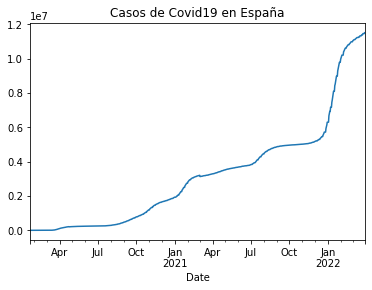
    


Otro ejemplo, esta vez con los casos de Covid en Colombia

## Tiempo real en Colombia


```python
url_co = 'https://api.covid19api.com/country/colombia/status/confirmed/live'
df_co = pd.read_json(url_co)
df_co.set_index('Date')['Cases'].plot(title='Datos de Covid19 en Colombia')
```


    <AxesSubplot:title={'center':'Datos de Covid19 en Colombia'}, xlabel='Date'>


    
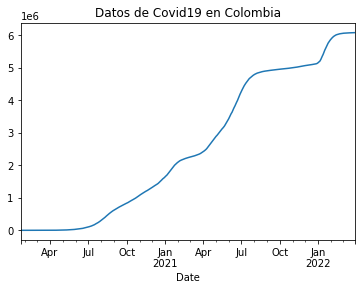
    


## Comparativa España-Colombia

Para tener un gráfico en el que se vean los dos juntos se unen con la fórmula: *Casos españa = fórmula enterior* *Casos Colombia= fórmula anterior* y lo ejecutamos


```python
casos_es = df_es.set_index('Date') ['Cases']
casos_co = df_co.set_index('Date') ['Cases']
```

Ahora, empleamos una nueva función de Pandas que se llama *concatenar*. Con esta función le decimos que nos una y compare las dos estadísticas anteriores a la vez. Después, marcamos que nos la ponga en el eje *axis* 1, para que nos lo ponga a la derecha


```python
pd.concat([casos_es,casos_co],axis=1)
```


<div>
<style scoped>
    .dataframe tbody tr th:only-of-type {
        vertical-align: middle;
    }

    .dataframe tbody tr th {
        vertical-align: top;
    }

    .dataframe thead th {
        text-align: right;
    }
</style>
<table border="1" class="dataframe">
  <thead>
    <tr style="text-align: right;">
      <th></th>
      <th>Cases</th>
      <th>Cases</th>
    </tr>
    <tr>
      <th>Date</th>
      <th></th>
      <th></th>
    </tr>
  </thead>
  <tbody>
    <tr>
      <th>2020-01-22 00:00:00+00:00</th>
      <td>0</td>
      <td>0</td>
    </tr>
    <tr>
      <th>2020-01-23 00:00:00+00:00</th>
      <td>0</td>
      <td>0</td>
    </tr>
    <tr>
      <th>2020-01-24 00:00:00+00:00</th>
      <td>0</td>
      <td>0</td>
    </tr>
    <tr>
      <th>2020-01-25 00:00:00+00:00</th>
      <td>0</td>
      <td>0</td>
    </tr>
    <tr>
      <th>2020-01-26 00:00:00+00:00</th>
      <td>0</td>
      <td>0</td>
    </tr>
    <tr>
      <th>...</th>
      <td>...</td>
      <td>...</td>
    </tr>
    <tr>
      <th>2022-03-26 00:00:00+00:00</th>
      <td>11451676</td>
      <td>6083291</td>
    </tr>
    <tr>
      <th>2022-03-27 00:00:00+00:00</th>
      <td>11451676</td>
      <td>6083643</td>
    </tr>
    <tr>
      <th>2022-03-28 00:00:00+00:00</th>
      <td>11451676</td>
      <td>6083939</td>
    </tr>
    <tr>
      <th>2022-03-29 00:00:00+00:00</th>
      <td>11508309</td>
      <td>6084240</td>
    </tr>
    <tr>
      <th>2022-03-30 00:00:00+00:00</th>
      <td>11508309</td>
      <td>6084551</td>
    </tr>
  </tbody>
</table>
<p>799 rows × 2 columns</p>
</div>


Ahora, metemos estos datos en un objeto que se llama *vs*, y así la comparativa saldrá con poner vs, no hace falta poner la fórmula completa


```python
vs = pd.concat([casos_es,casos_co],axis=1)
```

Para cambiar el nombre de las columnas lo hacemos de la misma forma, llamando las columnas como queramos:


```python
vs.columns = ['España', 'Colombia']
vs
```


<div>
<style scoped>
    .dataframe tbody tr th:only-of-type {
        vertical-align: middle;
    }

    .dataframe tbody tr th {
        vertical-align: top;
    }

    .dataframe thead th {
        text-align: right;
    }
</style>
<table border="1" class="dataframe">
  <thead>
    <tr style="text-align: right;">
      <th></th>
      <th>España</th>
      <th>Colombia</th>
    </tr>
    <tr>
      <th>Date</th>
      <th></th>
      <th></th>
    </tr>
  </thead>
  <tbody>
    <tr>
      <th>2020-01-22 00:00:00+00:00</th>
      <td>0</td>
      <td>0</td>
    </tr>
    <tr>
      <th>2020-01-23 00:00:00+00:00</th>
      <td>0</td>
      <td>0</td>
    </tr>
    <tr>
      <th>2020-01-24 00:00:00+00:00</th>
      <td>0</td>
      <td>0</td>
    </tr>
    <tr>
      <th>2020-01-25 00:00:00+00:00</th>
      <td>0</td>
      <td>0</td>
    </tr>
    <tr>
      <th>2020-01-26 00:00:00+00:00</th>
      <td>0</td>
      <td>0</td>
    </tr>
    <tr>
      <th>...</th>
      <td>...</td>
      <td>...</td>
    </tr>
    <tr>
      <th>2022-03-26 00:00:00+00:00</th>
      <td>11451676</td>
      <td>6083291</td>
    </tr>
    <tr>
      <th>2022-03-27 00:00:00+00:00</th>
      <td>11451676</td>
      <td>6083643</td>
    </tr>
    <tr>
      <th>2022-03-28 00:00:00+00:00</th>
      <td>11451676</td>
      <td>6083939</td>
    </tr>
    <tr>
      <th>2022-03-29 00:00:00+00:00</th>
      <td>11508309</td>
      <td>6084240</td>
    </tr>
    <tr>
      <th>2022-03-30 00:00:00+00:00</th>
      <td>11508309</td>
      <td>6084551</td>
    </tr>
  </tbody>
</table>
<p>799 rows × 2 columns</p>
</div>


Ahora, para hacer la gráfica hay usar la fórmula *vs.plot("x VS y")* En nuestro caso, X es España e Y Colombia. .PLOT ES LO QUE SE UTILIZA PARA CREAR EL GRÁFICO


```python
vs.plot(title="España VS Colombia")
```


    <AxesSubplot:title={'center':'España VS Colombia'}, xlabel='Date'>


    
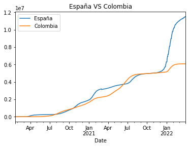
    


## Triple Comparativa España, Colombia y Angola


```python
url_an = 'https://api.covid19api.com/country/angola/status/confirmed/live'
df_an = pd.read_json(url_an)
df_an.set_index('Date')['Cases'].plot(title
                                      ='Datos de Covid19 en Angola')
```


    <AxesSubplot:title={'center':'Datos de Covid19 en Angola'}, xlabel='Date'>


    
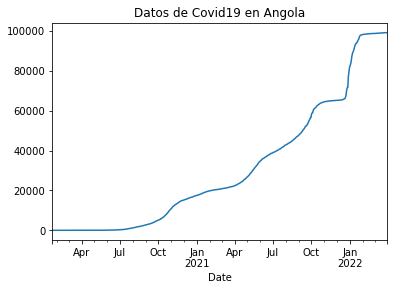
    


```python
casos_es = df_es.set_index('Date') ['Cases']
casos_co = df_co.set_index('Date') ['Cases']
casos_an = df_an.set_index('Date') ['Cases']
```


```python
pd.concat([casos_es,casos_co,casos_an],axis=1)
```


<div>
<style scoped>
    .dataframe tbody tr th:only-of-type {
        vertical-align: middle;
    }

    .dataframe tbody tr th {
        vertical-align: top;
    }

    .dataframe thead th {
        text-align: right;
    }
</style>
<table border="1" class="dataframe">
  <thead>
    <tr style="text-align: right;">
      <th></th>
      <th>Cases</th>
      <th>Cases</th>
      <th>Cases</th>
    </tr>
    <tr>
      <th>Date</th>
      <th></th>
      <th></th>
      <th></th>
    </tr>
  </thead>
  <tbody>
    <tr>
      <th>2020-01-22 00:00:00+00:00</th>
      <td>0.0</td>
      <td>0.0</td>
      <td>0</td>
    </tr>
    <tr>
      <th>2020-01-23 00:00:00+00:00</th>
      <td>0.0</td>
      <td>0.0</td>
      <td>0</td>
    </tr>
    <tr>
      <th>2020-01-24 00:00:00+00:00</th>
      <td>0.0</td>
      <td>0.0</td>
      <td>0</td>
    </tr>
    <tr>
      <th>2020-01-25 00:00:00+00:00</th>
      <td>0.0</td>
      <td>0.0</td>
      <td>0</td>
    </tr>
    <tr>
      <th>2020-01-26 00:00:00+00:00</th>
      <td>0.0</td>
      <td>0.0</td>
      <td>0</td>
    </tr>
    <tr>
      <th>...</th>
      <td>...</td>
      <td>...</td>
      <td>...</td>
    </tr>
    <tr>
      <th>2022-03-27 00:00:00+00:00</th>
      <td>11451676.0</td>
      <td>6083643.0</td>
      <td>99115</td>
    </tr>
    <tr>
      <th>2022-03-28 00:00:00+00:00</th>
      <td>11451676.0</td>
      <td>6083939.0</td>
      <td>99115</td>
    </tr>
    <tr>
      <th>2022-03-29 00:00:00+00:00</th>
      <td>11508309.0</td>
      <td>6084240.0</td>
      <td>99138</td>
    </tr>
    <tr>
      <th>2022-03-30 00:00:00+00:00</th>
      <td>11508309.0</td>
      <td>6084551.0</td>
      <td>99138</td>
    </tr>
    <tr>
      <th>2022-03-31 00:00:00+00:00</th>
      <td>NaN</td>
      <td>NaN</td>
      <td>99138</td>
    </tr>
  </tbody>
</table>
<p>800 rows × 3 columns</p>
</div>


```python
vs = pd.concat([casos_es,casos_co,casos_an],axis=1)
```


```python
vs.columns = ['España', 'Colombia', 'Angola']
vs
```


<div>
<style scoped>
    .dataframe tbody tr th:only-of-type {
        vertical-align: middle;
    }

    .dataframe tbody tr th {
        vertical-align: top;
    }

    .dataframe thead th {
        text-align: right;
    }
</style>
<table border="1" class="dataframe">
  <thead>
    <tr style="text-align: right;">
      <th></th>
      <th>España</th>
      <th>Colombia</th>
      <th>Angola</th>
    </tr>
    <tr>
      <th>Date</th>
      <th></th>
      <th></th>
      <th></th>
    </tr>
  </thead>
  <tbody>
    <tr>
      <th>2020-01-22 00:00:00+00:00</th>
      <td>0.0</td>
      <td>0.0</td>
      <td>0</td>
    </tr>
    <tr>
      <th>2020-01-23 00:00:00+00:00</th>
      <td>0.0</td>
      <td>0.0</td>
      <td>0</td>
    </tr>
    <tr>
      <th>2020-01-24 00:00:00+00:00</th>
      <td>0.0</td>
      <td>0.0</td>
      <td>0</td>
    </tr>
    <tr>
      <th>2020-01-25 00:00:00+00:00</th>
      <td>0.0</td>
      <td>0.0</td>
      <td>0</td>
    </tr>
    <tr>
      <th>2020-01-26 00:00:00+00:00</th>
      <td>0.0</td>
      <td>0.0</td>
      <td>0</td>
    </tr>
    <tr>
      <th>...</th>
      <td>...</td>
      <td>...</td>
      <td>...</td>
    </tr>
    <tr>
      <th>2022-03-27 00:00:00+00:00</th>
      <td>11451676.0</td>
      <td>6083643.0</td>
      <td>99115</td>
    </tr>
    <tr>
      <th>2022-03-28 00:00:00+00:00</th>
      <td>11451676.0</td>
      <td>6083939.0</td>
      <td>99115</td>
    </tr>
    <tr>
      <th>2022-03-29 00:00:00+00:00</th>
      <td>11508309.0</td>
      <td>6084240.0</td>
      <td>99138</td>
    </tr>
    <tr>
      <th>2022-03-30 00:00:00+00:00</th>
      <td>11508309.0</td>
      <td>6084551.0</td>
      <td>99138</td>
    </tr>
    <tr>
      <th>2022-03-31 00:00:00+00:00</th>
      <td>NaN</td>
      <td>NaN</td>
      <td>99138</td>
    </tr>
  </tbody>
</table>
<p>800 rows × 3 columns</p>
</div>


```python
vs.plot(title="España VS Colombia VS Angola")
```


    <AxesSubplot:title={'center':'España VS Colombia VS Angola'}, xlabel='Date'>


    
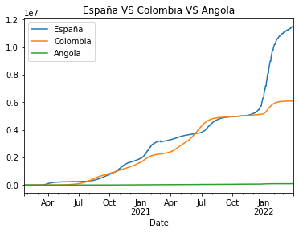
    


## Seleccionar más columnas

Para seleccionar más columnas basta con meter los valores que quieras añadir en doble corchete manteniendo el principal en primer lugar entre paréntesis


```python
df_es.set_index('Date')[['Cases','Lon']]
```


<div>
<style scoped>
    .dataframe tbody tr th:only-of-type {
        vertical-align: middle;
    }

    .dataframe tbody tr th {
        vertical-align: top;
    }

    .dataframe thead th {
        text-align: right;
    }
</style>
<table border="1" class="dataframe">
  <thead>
    <tr style="text-align: right;">
      <th></th>
      <th>Cases</th>
      <th>Lon</th>
    </tr>
    <tr>
      <th>Date</th>
      <th></th>
      <th></th>
    </tr>
  </thead>
  <tbody>
    <tr>
      <th>2020-01-22 00:00:00+00:00</th>
      <td>0</td>
      <td>-3.75</td>
    </tr>
    <tr>
      <th>2020-01-23 00:00:00+00:00</th>
      <td>0</td>
      <td>-3.75</td>
    </tr>
    <tr>
      <th>2020-01-24 00:00:00+00:00</th>
      <td>0</td>
      <td>-3.75</td>
    </tr>
    <tr>
      <th>2020-01-25 00:00:00+00:00</th>
      <td>0</td>
      <td>-3.75</td>
    </tr>
    <tr>
      <th>2020-01-26 00:00:00+00:00</th>
      <td>0</td>
      <td>-3.75</td>
    </tr>
    <tr>
      <th>...</th>
      <td>...</td>
      <td>...</td>
    </tr>
    <tr>
      <th>2022-03-26 00:00:00+00:00</th>
      <td>11451676</td>
      <td>-3.75</td>
    </tr>
    <tr>
      <th>2022-03-27 00:00:00+00:00</th>
      <td>11451676</td>
      <td>-3.75</td>
    </tr>
    <tr>
      <th>2022-03-28 00:00:00+00:00</th>
      <td>11451676</td>
      <td>-3.75</td>
    </tr>
    <tr>
      <th>2022-03-29 00:00:00+00:00</th>
      <td>11508309</td>
      <td>-3.75</td>
    </tr>
    <tr>
      <th>2022-03-30 00:00:00+00:00</th>
      <td>11508309</td>
      <td>-3.75</td>
    </tr>
  </tbody>
</table>
<p>799 rows × 2 columns</p>
</div>


## Tipo de gráfico

Para elegir el típo de gráfico que se prefiera hay que utilizar el código *kind* dentro de los paréntesis 
En este caso, es un gráfico de áreas *area*


```python
vs.plot(title="España VS Colombia", kind='area')
```


    <AxesSubplot:title={'center':'España VS Colombia'}, xlabel='Date'>


    

    


El parámetro kind puede tomar diferentes argumentos en función del gráfico que mejor nos convenga por nuestro contenido.
En este caso es un gráfico de líenas'line' (lineas), 'bar' (barras verticales), 'barh' (barras horizontales), 'hist' (histograma), 'box' (cajas), 'density' (densidad), 'area' (area) 


```python
vs.plot(title="España VS Colombia", kind='line')
```


    <AxesSubplot:title={'center':'España VS Colombia'}, xlabel='Date'>


    
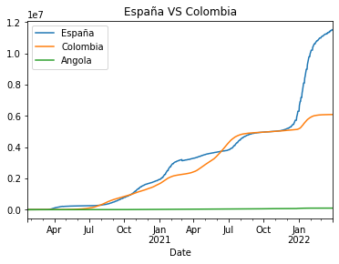
    


En este caso es un gráfico de barras verticales *bar* 'barh' (barras horizontales), 'hist' (histograma), 'box' (cajas), 'density' (densidad), 'area' (area) 


```python
vs.plot(title="España VS Colombia", kind='bar')
```


    <AxesSubplot:title={'center':'España VS Colombia'}, xlabel='Date'>


    
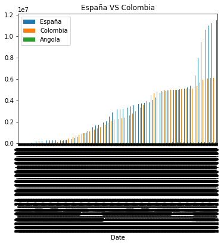
    


En este caso es un gráfico de barras horizontales *barh* 'barh' (barras horizontales), 'hist' (histograma), 'box' (cajas), 'density' (densidad), 'area' (area) 


```python
vs.plot(title="España VS Colombia", kind='barh')
```


    <AxesSubplot:title={'center':'España VS Colombia'}, ylabel='Date'>


    
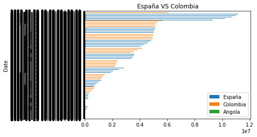
    


En este caso es un histograma *hist* 


```python
vs.plot(title="España VS Colombia", kind='hist')
```


    <AxesSubplot:title={'center':'España VS Colombia'}, ylabel='Frequency'>


    
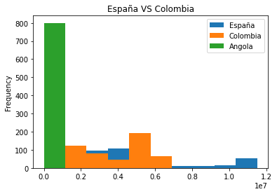
    


En este caso es un gráfico de cajas'box' 


```python
vs.plot(title="España VS Colombia", kind='box')
```


    <AxesSubplot:title={'center':'España VS Colombia'}>


    
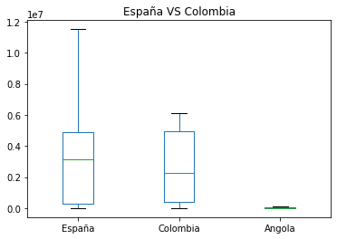
    


En este caso es un gráfico de densidad *density* 


```python
vs.plot(title="España VS Colombia", kind='density')
```


    <AxesSubplot:title={'center':'España VS Colombia'}, ylabel='Density'>


    
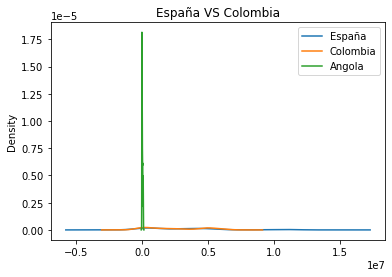
    


## Exportar datos

El siguiente paso es guardar en CSV (Valores Separados por Comas), es el tipo de datos mayoritarios porque es texto y apenas pesa. Los datos que hemos generado los vamos a pasar a CSV para poder llevarlo a otro formato como Word o Excell. 
Vamos a la carpeta donde está creado nuestro archivo (en este caso carpeta/add/api-covid19-pandas.ipynb) para ver si lo ha convertido correctamente. 


```python
vs.to_csv('vs.cvs')
```

Después, se abre una línea nueva para crear un objeto para llamar al término figura. Para exportar el gráfico 


```python
grafico = vs.plot()
fig = grafico.get_figure()
fig.savefig("vs.png")

```


    
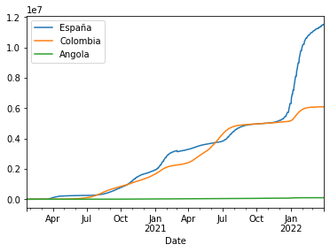
    


```python

```
